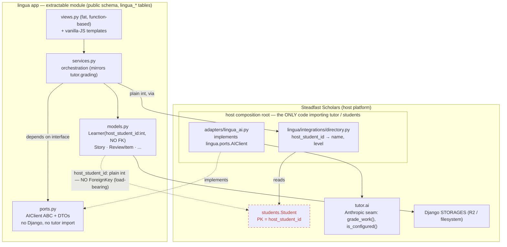
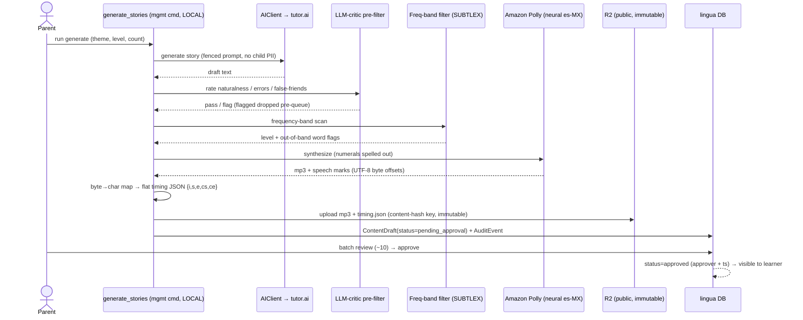
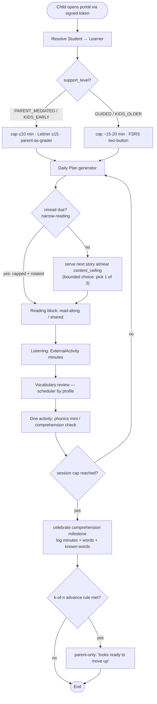
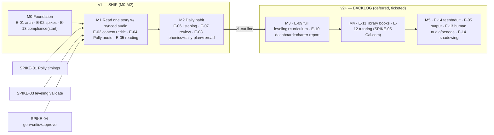

# Lingua — Architecture Diagrams

Five diagrams for the Spanish acquisition module. See `SPEC.md` (build) and `DECISIONS.md` (rationale).

---

## 1. Module boundary — the "no FK across the seam" rule

The dashed red edge is the load-bearing rule (D-03): `lingua` never holds a ForeignKey into the host.
The learner is a plain `host_student_id` int resolved through the UserDirectory adapter; the only code that
imports `tutor` is the host's `lingua_ai.py` adapter. This is what makes the module extractable.



---

## 2. Content authoring pipeline (runs LOCALLY, like the manga `generate_*` flow)

AI generation → LLM-critic pre-filter → frequency-band leveling → Polly TTS + word timings → R2 →
parent batch approval → published. Nothing heavy runs on the web dyno (D-16).



---

## 3. Daily learning session flow

Branches by `support_level`; the session-length cap is a hard constraint set by support_level, not by
content level (D-66); the scheduler splits Leitner (parent-graded) vs FSRS (two-button).



---

## 4. Data model ERD (v1)

`host_student_id` is shown as a non-FK reference (dotted) — the boundary rule made explicit. Lingua-internal
relations are ordinary CASCADE FKs. `ExternalActivity`/`ListeningLog` reuse the host activities app (N-02).

```mermaid
erDiagram
  Student ||..o| Learner : "host_student_id — plain int, NO FK"
  Learner ||--|| LearnerProfile : has
  Learner ||--o{ ReviewItem : owns
  Learner ||--o{ ReadingSession : logs
  Learner ||--o{ KnownWord : accumulates
  Learner ||--o{ AdvancementSignal : receives
  Theme ||--o{ Story : themes
  Story ||--|| StoryAudio : "per voice"
  Story ||--o{ StoryWord : "tokens (cognate/freq flags)"
  Story ||--o{ ComprehensionCheck : has
  Story ||--o| ContentDraft : "from approval"
  Story ||--o{ ReadingSession : "read in"
  VocabEntry ||--o{ ReviewItem : reviewed-as
  VocabEntry ||--o{ KnownWord : credited-as
  ContentDraft ||--o{ AuditEvent : logged
  ExternalActivity ||--o{ ListeningLog : "minutes (host reuse)"

  Learner {
    int host_student_id "NO FK — resolves via UserDirectory"
    string language "es"
    string variant "es-MX"
  }
  LearnerProfile {
    string track_profile "KIDS_EARLY|KIDS_OLDER"
    string support_level "PARENT_MEDIATED|GUIDED|INDEPENDENT"
    string content_ceiling "L1..L8"
  }
  ReviewItem {
    string scheduler "leitner|fsrs"
    json scheduler_state
    datetime due "indexed mirror"
    datetime paused_until
  }
  Story {
    string language "es"
    string level "L1..L8 (hand + freq-band)"
    text body
    fk theme
  }
  StoryAudio {
    string provider "polly"
    string voice "Mia"
    json timings "flat {i,s,e,cs,ce}"
    string r2_key "content-hash, public immutable"
  }
  ContentDraft {
    string status "pending_approval|approved"
    int approved_by "host user id"
    datetime approved_at
  }
```

---

## 5. Milestone roadmap — v1 cut line after M2


